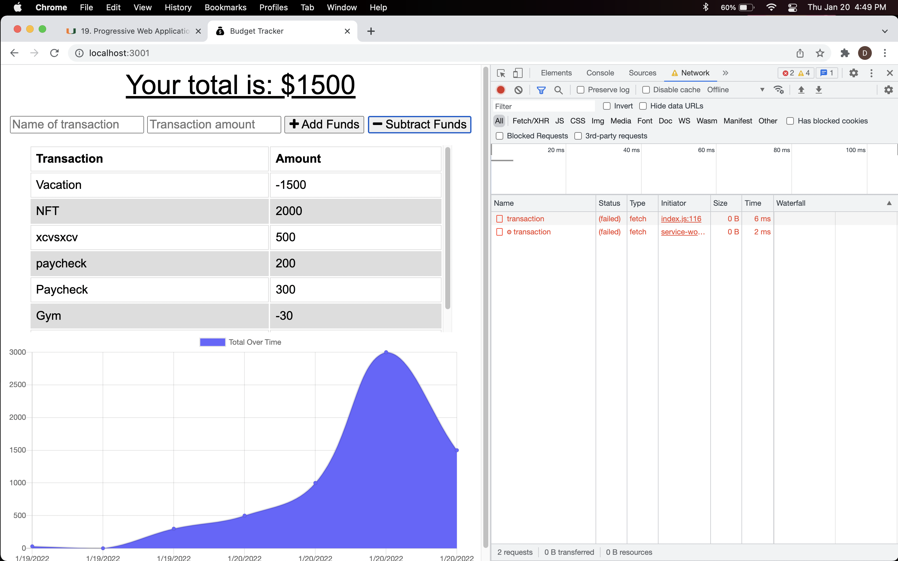

# PWA Budget Tracker 

## About this program

Budget Tracker is a progressive web application in which the user can track their transactions either online or offline. Using service workers and indexedDB, information that is inserted to the application will be saved offline and later inputed automatically once connection is reestablished. The application will also be completely functional while offline only if used before by the same browser.

## Contributing
Hector Perez

## Built with

* Javascript
* node.js
* mongoDB
* mongoose
* express
* webpack-cli

### Questions
Contact me:

[Github](https://www.github.com/hpere102)  
[Email](mailto:hpere102@fiu.edu)